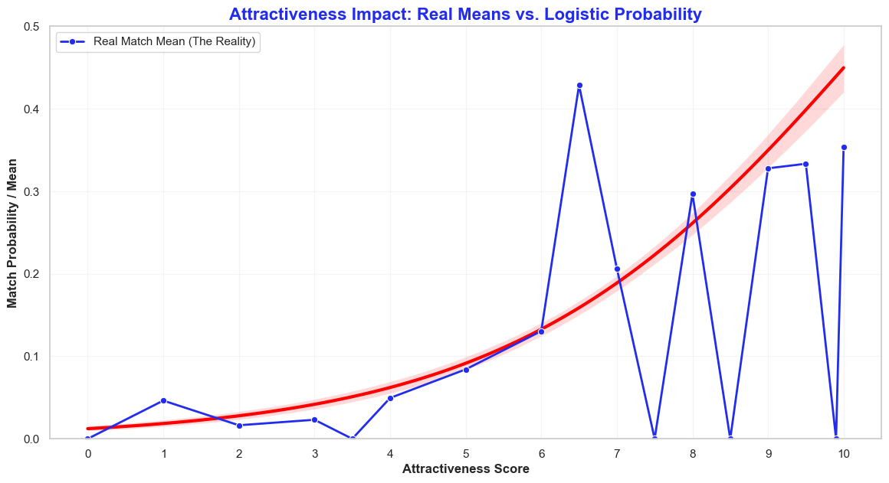
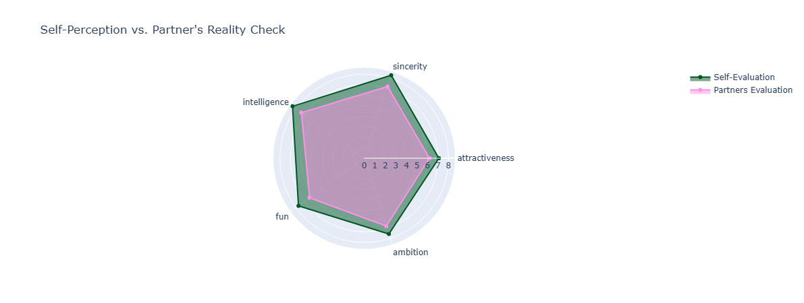

# 💘 Speed Dating Analysis: The "Say vs. Do" Paradox

## 📌 Project Overview

This project explores the mechanics of human attraction using the famous Columbia University Speed Dating dataset. The core objective is to confront participants' stated preferences (**what they say they want**) with their actual decisions during the dates (**what they actually do**).

As an aspiring **Data Scientist/Analyst**, this project demonstrates my ability to clean complex datasets, manage relational integrity between variables, and transform raw statistics into compelling sociological insights.

---

## 🛠️ Tech Stack & Skills

* **Data Manipulation**: `Pandas`, `NumPy`
* **Data Visualization**: `Seaborn`, `Matplotlib`, `Plotly` (for interactive Radar Charts)
* **Data Engineering**: Sparsity management (dropping columns with >15% missing values), automated encoding detection with `chardet`.
* **Statistical Analysis**: Pearson correlation, grouped aggregations, and data reshaping (Long vs. Wide format).

---

## 📊 Key Findings

### 1. The "Say vs. Do" Disconnect

Participants officially claim to seek a balance between intelligence, sincerity, and fun. However, real-world data shows that **physical attractiveness** is the true "gatekeeper."

* **SAY**: Attractiveness is ranked at ~22.5% in declared importance.
* **DO**: An attractiveness score below 6/10 reduces the chance of a match to near zero, regardless of scores in other categories.

### 2. The Myth of Rational Compatibility

Contrary to popular belief, "rational" compatibility factors have almost no influence on the final match:

* **Shared Interests / Same Religion**: Near-zero correlation ($r \approx 0.03$).
* **Same Race**: Negligible impact on the final decision ($r \approx -0.01$).

### 3. The Ego Gap

The self-evaluation analysis reveals an **Illusory Superiority Bias**. On average, participants rate themselves **0.70 points** higher than the actual ratings given by their partners.

---

## 📂 Project Structure

* **Section 1-3: Setup & Audit**: Data loading and creation of a dynamic Data Dictionary to assess initial data quality.
* **Section 4: Data Engineering**:
* Filtering columns with high nullity.
* Repairing ID integrity (Wave 5, missing participant IDs).
* Categorical mapping for human-readable visualizations.
* **Section 5: Exploratory Data Analysis (EDA)**:
* Visualization of the "desirability hierarchy" (SAY).
* Analysis of the Gender Expectation Gap.
* Expectation vs. Reality confrontation (DO).
* Radar Chart analysis of self-perception.

---

## 🚀 How to Run

1. Clone the repository.
2. Ensure `Speed+Dating+Data.csv` is in the root directory.
3. Install dependencies: `pip install pandas numpy seaborn matplotlib plotly chardet`.
4. Launch the Jupyter Notebook.

---

## 💡 Conclusion

This project demonstrates that speed dating is not a rational marketplace based on a checklist of criteria. It is an environment where **physical appeal opens the door**, and where individuals are statistically much more lenient toward themselves than they are toward others.

---

### 📬 Contact

**[ZAKHER Bassem]** - Data Scientist.  
[https://www.linkedin.com/in/bassem-zakher/]